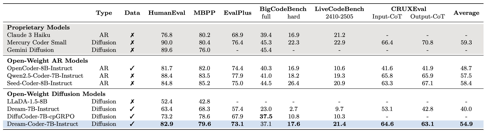

<div align="center">

#  Dream-Coder 7B
</div>
<div>
<br>

<div align="center">

[](https://hkunlp.github.io/blog/2025/dream-coder/)
[](https://zhxie.notion.site/Dream-Coder-7B-1d608d27359e805d9e56dc0fbee945b1)
[](https://x.com/_zhihuixie/status/1945140882795274598)
[](https://huggingface.co/collections/Dream-org/dream-coder-7b-68761cfa0e218f0776a84ee7)

</div>
</div>

## Introduction
Dream-Coder 7B is a **diffusion LLM for code** trained exclusively on open-source data across its development stages—adaptation, supervised fine-tuning, and reinforcement learning. It achieves an impressive 21.4% pass@1 on LiveCodeBench (2410-2505), outperforming other open-source diffusion LLMs by a wide margin.

<p align="center">
    
<p>

## Features
### Flexible Code Generation
We observe Dream-Coder 7B exhibits emergent any-order generation that adaptively determines its decoding style based on the coding task. For example, Dream-Coder 7B Instruct displays patterns such as:

<table>
  <tr>
    <td rowspan="2" align="center">
      
      <p align="center"><em>Sketch-First Generation</em></p>
    </td>
    <td align="center">
      
      <p align="center"><em>Left-to-Right Generation</em></p>
    </td>
  </tr>
  <tr>
    <td align="center">
      
      <p align="center"><em>Iterative Back-and-Forth Generation</em></p>
    </td>
  </tr>
</table>

These demos were collected using consistent sampling parameters: `temperature=0.1, diffusion_steps=512, max_new_tokens=512, alg="entropy", top_p=1.0, alg_temp=0.0, eos_penalty=3.0`.

### Variable-Length Code Infilling
We also introduce an infilling variant, **DreamOn-7B**, that naturally adjusts the length of masked spans during generation for variable-length code infilling. For more details, please refer to our accompanying [blog post](https://www.notion.so/DreamOn-Diffusion-Language-Models-For-Code-Infilling-Beyond-Fixed-Size-Canvas-228be544bdbb80cc991ef540e7805bd7).

## Quickstart
To get start with,
please install `transformers==4.46.2` and `torch==2.5.1`. Here is an example to use Dream-Coder 7B:

```python
import torch
from transformers import AutoModel, AutoTokenizer

model_path = "Dream-org/Dream-Coder-v0-Instruct-7B"
model = AutoModel.from_pretrained(model_path, torch_dtype=torch.bfloat16, trust_remote_code=True)
tokenizer = AutoTokenizer.from_pretrained(model_path, trust_remote_code=True)
model = model.to("cuda").eval()

messages = [
    {"role": "user", "content": "Write a quick sort algorithm."}
]
inputs = tokenizer.apply_chat_template(
    messages, return_tensors="pt", return_dict=True, add_generation_prompt=True
)
input_ids = inputs.input_ids.to(device="cuda")
attention_mask = inputs.attention_mask.to(device="cuda")

output = model.diffusion_generate(
    input_ids,
    attention_mask=attention_mask,
    max_new_tokens=768,
    output_history=True,
    return_dict_in_generate=True,
    steps=768,
    temperature=0.1,
    top_p=0.95,
    alg="entropy",
    alg_temp=0.,
)
generations = [
    tokenizer.decode(g[len(p) :].tolist())
    for p, g in zip(input_ids, output.sequences)
]

print(generations[0].split(tokenizer.eos_token)[0])
```

## Releases
- [x] [Our blog](https://hkunlp.github.io/blog/2025/dream-coder/) and [model weights](https://huggingface.co/collections/Dream-org/dream-coder-7b-68761cfa0e218f0776a84ee7)
- [ ] Data processing scripts
- [ ] Training recipes based on [verl](https://github.com/volcengine/verl)

## Citation
```
@misc{dreamcoder2025,
    title = {Dream-Coder 7B},
    url = {https://hkunlp.github.io/blog/2025/dream-coder},
    author = {Xie, Zhihui and Ye, Jiacheng and Zheng, Lin and Gao, Jiahui and Dong, Jingwei and Wu, Zirui and Zhao, Xueliang and Gong, Shansan and Jiang, Xin and Li, Zhenguo and Kong, Lingpeng},
    year = {2025}
}
```
